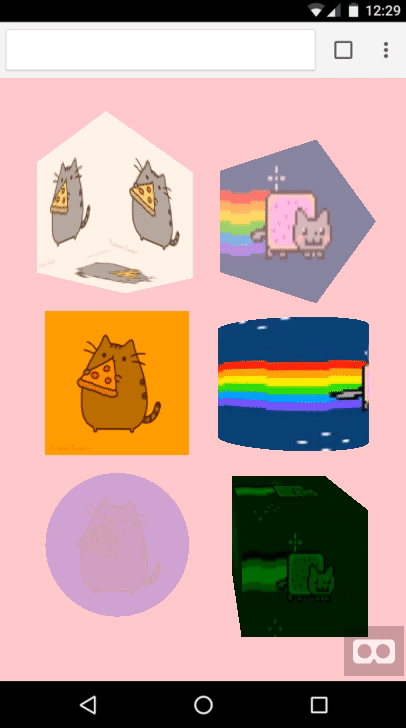

# AFrame GIF Shader

**A gif shader for [A-Frame](https://aframe.io) VR. Inspired by [@gtk2k](https://github.com/gtk2k)'s [awesome sample](https://github.com/gtk2k/gtk2k.github.io/tree/master/animation_gif).**

**To control, please use [`aframe-gif-component`](https://github.com/mayognaise/aframe-gif-component).**

**[DEMO](https://mayognaise.github.io/aframe-gif-shader/basic/index.html)**



**Now transparent gif are supported!** 🎉🎊

## Properties

- Basic material's properties are supported.
- The property is pretty much same as `flat` shader.

| Property | Description | Default Value |
| -------- | ----------- | ------------- |
|src|image url. @see [Textures](https://aframe.io/docs/components/material.html#Textures)|null|
|autoplay|play automatecally once it's ready|true|

For refference, please check the following links:

- [Material](https://aframe.io/docs/master/components/material.html)
- [Textures](https://aframe.io/docs/master/components/material.html#textures)
- [Flat Shading Model](https://aframe.io/docs/core/shaders.html#Flat-Shading-Model)

## Usage

### Browser Installation

Install and use by directly including the [browser files](dist):

```html
<head>
  <title>My A-Frame Scene</title>
  <script src="https://aframe.io/releases/0.9.0/aframe.min.js"></script>
  <script src="https://rawgit.com/mayognaise/aframe-gif-shader/master/dist/aframe-gif-shader.min.js"></script>
</head>

<body>
  <a-scene>
    <a-entity geometry="primitive:box;" material="shader:gif;src:url(nyancat.gif);color:green;opacity:.8"></a-entity>
  </a-scene>
</body>
```

### NPM Installation

Install via NPM:

```bash
npm i -D aframe-gif-shader
```

Then register and use.

```js
import 'aframe'
import 'aframe-gif-shader'
```

### Contributors

Thank you so much 🙏

- [@UXVirtual](https://github.com/UXVirtual)
- [@urish](https://github.com/urish)
- [@pablodiegoss](https://github.com/pablodiegoss)
- [@margauxdivernois](https://github.com/margauxdivernois)
- [@Danpollak](https://github.com/Danpollak)
